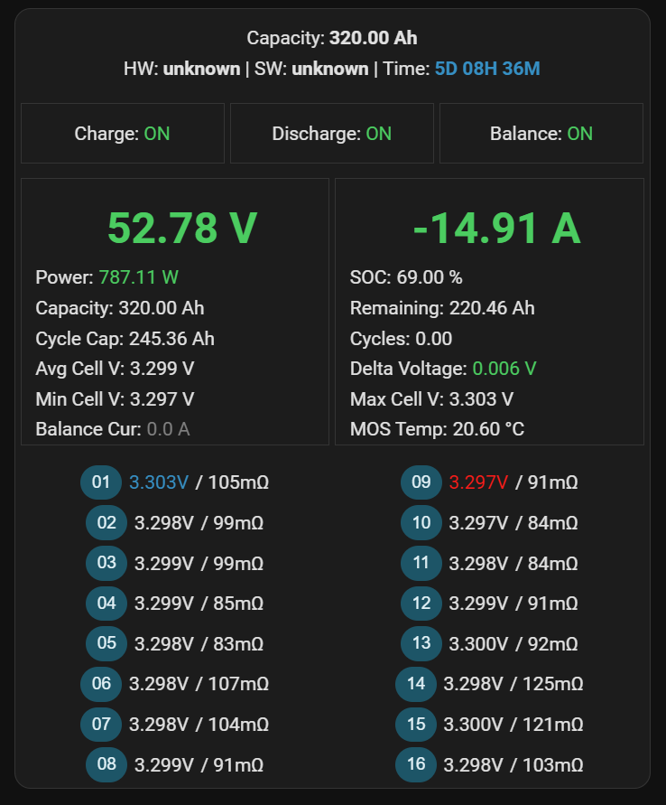
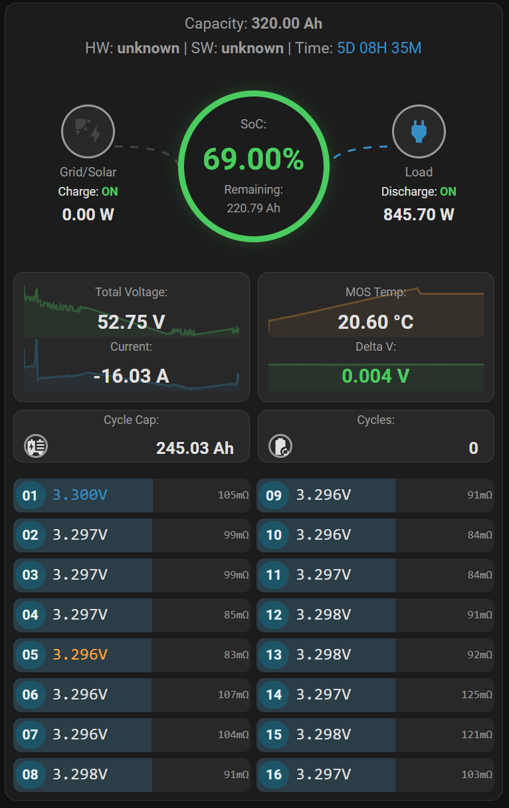

# JK BMS Passive Bridge

Passive multi-pack JK BMS RS485 bridge for Home Assistant.

## Problem solved

This project solves one very specific problem:

**reading multiple JK BMS packs from one RS485 bus without becoming another bus master.**

This matters in real installations where:

- one JK pack already acts as the master on UART2 / RS485
- one or more slave packs answer on the same bus
- a Deye inverter or another external device is already connected
- Home Assistant should receive the same data without sending active queries

Most JK integrations assume they can poll one BMS directly. That is often not
the right model for a shared bus with multiple packs. This bridge takes the
opposite approach:

- do not poll the production bus
- do not compete with the existing master
- only decode what is already present on the wire

This project listens to the JK UART2 / RS485 traffic without sending active
queries on the bus. It is meant for installations where a master device
already owns the bus, for example:

- JK master pack polling multiple slave packs
- Deye inverter connected to the battery bus
- Home Assistant consuming the same data passively through MQTT

In addition to passive realtime/config decoding, the bridge can optionally send
an infrequent active `0x1400` about/version query to enrich the data with:

- hardware version
- software version
- serial number
- bluetooth name
- first-on date

Sensitive values such as the Bluetooth PIN and password are published only in a
masked form. The raw values are available only through the dedicated probe
tool.

## What it does

- Passively decodes JK `0x01` and `0x02` frames from the bus
- Identifies the source pack using the short Modbus delimiter after each JK frame
- Publishes MQTT discovery and state topics for Home Assistant
- Uses entity names compatible with [`jk-bms-card`](https://github.com/Pho3niX90/jk-bms-card)
- Includes forensic tools for live monitoring, passive capture, frame analysis, and MQTT cleanup

## Why this exists

Many JK BMS integrations assume they can poll the device directly. That is not
always safe on a shared bus where another master is already active. This bridge
focuses on the passive case: read what is already on the wire and do not inject
queries into the production bus.

## What can be observed on the bus

On the tested setup, the useful passive traffic is made of two JK frame types:

- `0x01` = config / settings block
- `0x02` = realtime / status block

Each JK frame is followed by a short Modbus write-style delimiter. That
delimiter is the key to pack identification.

Example, master pack realtime frame:

```text
55 AA EB 90 02 00 ...
00 10 16 20 00 01 05 9A
```

Example, master pack config frame:

```text
55 AA EB 90 01 00 ...
00 10 16 1E 00 01 64 56
```

Example, slave pack realtime frame:

```text
55 AA EB 90 02 00 ...
02 10 16 20 00 01 04 78
```

What these examples show:

- `55 AA EB 90` is the JK frame header
- the JK frame byte after the header identifies the block type:
  - `01` = config
  - `02` = realtime
- the first byte of the short delimiter identifies the source pack:
  - `00` = master pack
  - `02` = slave pack with address `0x02`
- the delimiter register byte distinguishes the JK bulk block:
  - `1E` -> config block
  - `20` -> realtime block

On the tested installation, these frames repeat continuously for each pack.
In a clean 60 second capture, the bridge observed:

- 9 valid `0x01` frames for pack `0x00`
- 9 valid `0x02` frames for pack `0x00`
- 9 valid `0x01` frames for pack `0x02`
- 9 valid `0x02` frames for pack `0x02`

See [docs/protocol-notes.md](docs/protocol-notes.md) for a more detailed
explanation of what is visible in a passive dump and which fields are carried
by each frame type.

## Current scope

Tested on a real setup with:

- JK BMS PB2A16S20P packs
- 2 packs in parallel
- UART2 / RS485 passive sniffing
- Home Assistant over MQTT
- entity naming aligned with `jk-bms-card`

The parser currently relies on full `300-byte` frames for stable state updates.
Shorter frames are tracked as partial frames and ignored for state publication.

The optional active `about` query is intended for installations where this
serial adapter is connected to a JK RS485 port that is safe to query directly.

## Repository layout

- `src/jk_bms_passive_bridge/`
  - application code
- `config/config.example.yaml`
  - example runtime configuration
- `docs/`
  - architecture and usage notes
- `tests/`
  - parser and mapping tests

## Installation

If you want a beginner-friendly guide with exact commands, start here:

- [docs/beginner-step-by-step.md](docs/beginner-step-by-step.md)

```bash
python3 -m venv .venv
source .venv/bin/activate
pip install -U pip
pip install -e .
```

Create a local config file:

```bash
cp config/config.example.yaml config/config.yaml
```

Edit:

- serial port
- MQTT broker credentials
- pack names, addresses, prefixes

## Main commands

Run the Home Assistant poller:

```bash
jk-bms-ha-poller --config config/config.yaml
```

Run the live forensic monitor:

```bash
jk-bms-live-monitor --config config/config.yaml
```

Capture passive traffic for 60 seconds:

```bash
jk-bms-passive-capture captures/bus.bin --config config/config.yaml --seconds 60
```

Analyze a capture:

```bash
jk-bms-frame-analyzer captures/bus.bin
```

Clear retained MQTT topics from older runs:

```bash
jk-bms-mqtt-cleanup --config config/config.yaml
```

Actively probe the about/version block:

```bash
jk-bms-active-probe --pack 0x02 --query about --hex
```

## Examples

Real `jk-bms-active-probe` output from a working system, with sensitive values
masked.

### Example: realtime block

```text
(venv) iot@host:~/jk-bms-passive-bridge$ jk-bms-active-probe --pack 0x02 --query realtime --hex
{
  "baud": 115200,
  "pack_addr": "0x02",
  "parsed": {
    "alarm_bitmap": 0,
    "avg_cell_mv": 3303,
    "balancing_current_a": 0.0,
    "balancing_state": 0,
    "battery_voltage_0p01v": 16446,
    "capacity_remaining_ah": 190.059,
    "capacity_total_ah": 320.0,
    "cell_status_bitmap": 65535,
    "cells_mv": [
      3304,
      3302,
      3303,
      3303,
      3303,
      3302,
      3302,
      3303,
      3302,
      3304,
      3304,
      3304,
      3302,
      3303,
      3302,
      3302
    ],
    "charger_status_word": 256,
    "charging_cycles": 1,
    "charging_status": true,
    "current_a": -9.241,
    "delta_cell_mv": 2,
    "discharging_status": true,
    "heating_current_ma": 0,
    "max_cell_num": 1,
    "min_cell_num": 2,
    "mos_temp_c": 17.0,
    "pcl_status_word": 0,
    "power_w": 488.371,
    "precharge_status": 0,
    "resistances_mohm": [
      67,
      64,
      69,
      67,
      71,
      70,
      66,
      64,
      68,
      66,
      66,
      65,
      71,
      70,
      68,
      67
    ],
    "rtc_ticks": 10616997,
    "runtime_sec": 919017,
    "sensor_presence_word": 255,
    "sleep_time_sec": 7605247,
    "state_of_charge": 59,
    "state_of_health": 100,
    "system_beat_0p1s": 100663553,
    "temp1_c": 16.4,
    "temp2_c": 16.5,
    "temp3_c": 7.3,
    "temp4_c": 0.0,
    "temp5_c": 0.0,
    "time_cocpr_s": 0,
    "time_cscpr_s": 0,
    "time_dcocpr_s": 0,
    "time_dcscpr_s": 0,
    "total_charging_cycle_capacity_ah": 402.096,
    "total_voltage_v": 52.848,
    "user_alarm_1": 0,
    "user_alarm_2": 0
  },
  "port": "/dev/ttyUSB0",
  "query": "realtime",
  "request_hex": "02 10 16 20 00 01 02 00 00 c2 01",
  "response_hex": "55 aa eb 90 02 00 ... 02 10 16 20 00 01 04 78 04 10 16 20 00 01 02 00 00 e9 a1",
  "response_len": 319,
  "response_type": "0x02"
}
```

### Example: about/version block

```text
(venv) iot@host:~/jk-bms-passive-bridge$ jk-bms-active-probe --pack 0x02 --query about --hex
{
  "baud": 115200,
  "pack_addr": "0x02",
  "parsed": {
    "bluetooth_name": "Battery 2",
    "bluetooth_pin": "1****4",
    "first_on_date": "260507",
    "hardware_version": "19A",
    "manufacturer_device_id": "JK-PB2A16S20P",
    "odd_runtime_sec": 918900,
    "password": "ka***n2",
    "power_on_times": 9,
    "serial_number": "51**********3560",
    "software_version": "19.31",
    "user_data_2": "JK-BMS",
    "user_private_data": "JK-BMS"
  },
  "port": "/dev/ttyUSB0",
  "query": "about",
  "request_hex": "02 10 16 1c 00 01 02 00 00 c7 3d",
  "response_hex": "55 aa eb 90 03 00 4a 4b 2d 50 42 32 41 31 36 53 32 30 50 ... 02 20 02 10 16 1c 00 01 c4 74 0d 10 16 20 00 01 02 00 00 83 f1",
  "response_len": 319,
  "response_type": "0x03"
}
```

The Home Assistant poller does not publish the raw Bluetooth PIN or password.
It only publishes masked values. The active probe tool is the place for manual
inspection when you explicitly need the full raw response.

## Home Assistant

The poller publishes Home Assistant MQTT discovery automatically.

High level flow:

1. configure MQTT in `config/config.yaml`
2. run `jk-bms-ha-poller`
3. wait for valid RS485 frames
4. Home Assistant creates the entities through MQTT discovery
5. point `jk-bms-card` at the configured pack prefix

Example prefix:

- `jk_bms_pack_1`

Example entities:

- `sensor.jk_bms_pack_1_total_voltage`
- `sensor.jk_bms_pack_1_current`
- `sensor.jk_bms_pack_1_cell_voltage_1`
- `sensor.jk_bms_pack_1_cell_resistance_1`
- `switch.jk_bms_pack_1_charging`
- `binary_sensor.jk_bms_pack_1_balancing`

See [docs/home-assistant.md](docs/home-assistant.md) for:

- end-to-end setup
- example `jk-bms-card` configuration
- troubleshooting
- a more detailed HA explanation

For Grafana / VictoriaMetrics users, see:

- [docs/grafana.md](docs/grafana.md)
- [docs/grafana-dashboard-plain.json](docs/grafana-dashboard-plain.json)

For a ready-to-adapt service file, see:

- [docs/systemd.md](docs/systemd.md)

## Screenshots

Original `jk-bms-card` layout:



Core Reactor layout:



## Limitations

- Not all JK information appears passively on the bus
- Version / about blocks such as `0x1400` are not currently available in passive mode on the tested setup
- The project is intentionally conservative and avoids active reads on the production bus
- More JK hardware / firmware variants need field validation

For protocol notes and passive dump examples, see:

- [docs/architecture.md](docs/architecture.md)
- [docs/protocol-notes.md](docs/protocol-notes.md)

## Development

Run tests:

```bash
pip install -e .[dev]
pytest
```

## License

MIT
